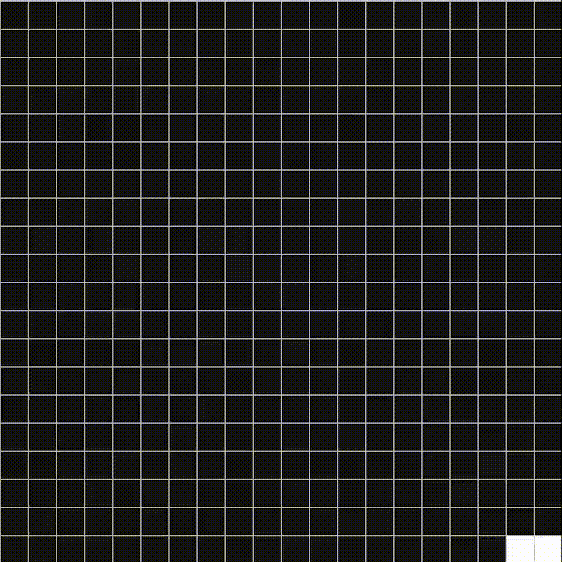
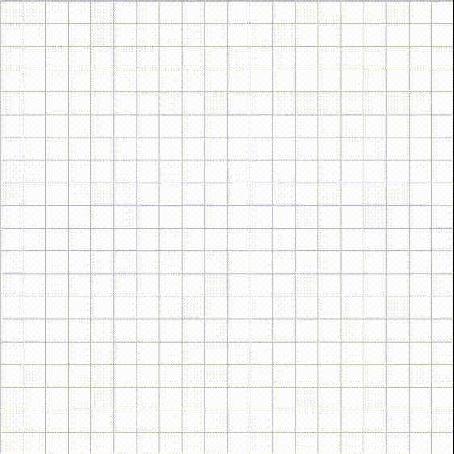

# Path Finding Algorithm Visualizer

## Introduction
This is a simple app written in python, with the help of the pygame graphics library. It visualizes the A* (a star) path finding algorithm. More algorithms will be added in the future

## A* Pathfinding Algorithm

A* is an informed search algorithm, or a best-first search, meaning that it is formulated in terms of weighted graphs: starting from a specific starting node of a graph, it aims to find a path to the given goal node having the smallest cost (least distance travelled, shortest time, etc.). It does this by maintaining a tree of paths originating at the start node and extending those paths one edge at a time until its termination criterion is satisfied.

## Prim's Algorithm

Prim's algorithm is a greedy algorithm that finds a minimum spanning tree for a weighted undirected graph. This means it finds a subset of the edges that forms a tree that includes every vertex, where the total weight of all the edges in the tree is minimized. The algorithm operates by building this tree one vertex at a time, from an arbitrary starting vertex, at each step adding the cheapest possible connection from the tree to another vertex.

A variation of this algorithm is used in this app to generate a simple maze for the path finding algorithm to traverse through.

## Functionality
`s - Place Start Node`

`e - Place End Node`

`r - Generate a maze using prim's algorithm`

`c - Clear map`

`lmb - Place walls`

`rmb - Remove walls`

`mmb - Flood-fill walls`

`space - Run simulation`

## Running the app
- Clone or download this github repository
- Install requirements
- Run

`$ git clone git@github.com:AzracStudios/path_finder_pygame.git`

`$ cd path_finder_pygame`

`$ pip install -r requirements.txt`

`$ python3 main.py`

Note: The commands might vary slightly based on the platform.

## Resources
Pygame Documentation: https://www.pygame.org/docs/

A* Algorithm: https://en.wikipedia.org/wiki/A*_search_algorithm

Prim's Algorithm: https://weblog.jamisbuck.org/2011/1/10/maze-generation-prim-s-algorithm

